# Data Analyst Job Market Analysis

*A SQL-driven exploration of skills, salaries, and trends in the data analyst job market*


---

## 📋 Project Overview

After applying to 75+ data analyst positions with minimal response, I realized I was navigating the job market blindly. Rather than continuing to apply without direction, I decided to take a data-driven approach to understand what employers actually value.

**The Question:** What skills, experience levels, and tool combinations do employers prioritize, and how do they impact compensation?

**The Solution:** I manually collected and analyzed 100 real data analyst job postings using SQL and Excel to identify actionable patterns that would inform my job search strategy and skill development priorities.

---

## 🎯 Key Findings (Executive Summary)

| Finding | Insight | Impact |
|---------|---------|--------|
| **SQL is foundational** | Appears in 87% of all job postings | Must-have skill for any analyst role |
| **Excel is underrated** | Required in 76% of jobs across all industries | Not just for "basic" work - it's universal |
| **Python = $11,722 salary premium** | Python roles pay 17% more than non-Python roles | High-value skill worth prioritizing |
| **Remote work pays competitively** | Remote jobs average $69k (on par with onsite) | Geographic flexibility doesn't mean lower pay |
| **BI tools add $3-7k to salary** | SQL + Tableau/Power BI pays more than SQL + Excel alone | Learning visualization tools increases earning potential |
| **Skills evolve with experience** | Entry-level emphasizes Excel/SQL; early-career requires Tableau/Python | Clear learning roadmap for career progression |
| **Healthcare is hiring** | 14 jobs in dataset with competitive $70k average salary | Strong industry target for job applications |

---

## 🛠️ Tools & Technologies

- **Database:** SQL Server Management Studio (SSMS)
- **Query Language:** T-SQL
- **Data Processing:** SQL (CTEs, joins, aggregations, conditional logic)
- **Visualization:** Microsoft Excel (bar charts, grouped charts, pivot tables)
- **Version Control:** GitHub

---

## 📊 Methodology

### 1. Data Collection (Manual)
- Sourced 100 job postings from Indeed and LinkedIn
- Focused on entry-level to 3-year experience analyst roles (Data Analyst, Business Analyst, BI Analyst, Junior Data Analyst)
- Recorded: job title, company, location, work type, salary range, required skills, experience level, industry, date posted
- Created two CSV files: `job_postings` (100 rows) and `job_skills` (492 rows - multiple skills per job)

### 2. Database Design & Data Pipeline
Built a two-stage SQL data pipeline to handle real-world data quality issues:

**Stage 1 - Raw Ingestion (Staging Layer):**
- Created tables with flexible VARCHAR schemas to accept inconsistent data formats
- Used `BULK INSERT` to load CSV files into SQL Server
- Handled encoding issues (UTF-8), NULL values, and inconsistent date/salary formats

**Stage 2 - Data Cleaning (Production Layer):**
- Created `job_postings_clean` table using `TRY_CAST()` to convert data types
- Transformed VARCHAR salary fields → INT
- Transformed VARCHAR dates → DATE type
- Maintained referential integrity with foreign key relationships between tables

**This approach mirrors real ETL workflows:** flexible ingestion → validated transformation → clean analysis layer.

### 3. SQL Analysis
Wrote 11 SQL queries using:
- **Joins** (inner joins, self-joins)
- **Aggregations** (COUNT, AVG, GROUP BY, HAVING)
- **CTEs** (Common Table Expressions for readability)
- **Conditional logic** (CASE statements, EXISTS, IN/NOT IN)
- **Window functions** (for ranking and comparative analysis)

### 4. Visualization
- Exported query results to Excel
- Created 11 professional charts (bar charts, grouped comparisons, pivot tables)
- Designed for clarity and consistency across all visualizations

---

## 🔍 Detailed Analysis & Insights

### Query 1: Top 10 Most In-Demand Skills

**Business Question:** What skills do employers prioritize most frequently?

**Key Findings:**
- **SQL:** 87% of jobs (foundational skill)
- **Excel:** 76% of jobs (underrated - appears across all industries)
- **Python:** 43% of jobs (significant but not universal)
- **Tableau/Power BI:** 40-45% of jobs (visualization tools highly valued)

**Insight:** SQL and Excel remain the core analyst toolkit. Python is a differentiator but not always required. BI tools are increasingly expected even at entry-level.

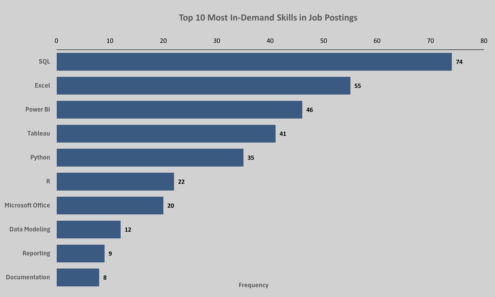

💻 **[View SQL Query](sql/business_queries/Query1.sql)**

---

### Query 2: How Experience Level Affects Salary

**Business Question:** How does required experience correlate with compensation?

**Key Findings:**
- **0-1 years:** ~$66k average
- **1-2 years:** ~$67k average (modest increase)
- **2+ years:** ~$75k average (significant jump)

**Insight:** The first meaningful salary increase occurs at the 2-year mark, where employers expect greater technical depth and autonomy. Entry-level roles cluster tightly around the mid-60s, with only marginal differentiation between 0-1 and 1-2 year requirements.

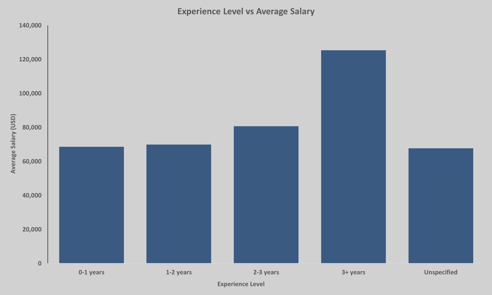

💻 **[View SQL Query](sql/business_queries/Query2.sql)**

---

### Query 3: Top-Paying Locations

**Business Question:** Which geographic markets offer the highest compensation?

**Key Findings:**
- **Chattanooga, TN:** $92,133 average (highest paying location in dataset)
- **Phoenix, NY:** $77,500 average
- **Boston, MA:** $75,986 average
- **Atlanta, GA:** $73,750 average
- **Tennessee (statewide):** $70,858 average
- **Denver, CO:** $68,071 average
- **New York, NY:** $67,750 average
- **Knoxville, TN:** $64,933 average (local market reference)
- **Cincinnati, OH:** $62,760 average (lowest in dataset)

**Insight:** Geographic salary differences are significant and not strictly tied to major metropolitan status. 
Chattanooga, TN leads all locations despite being a smaller market, suggesting strong local demand 
or specialized roles driving compensation upward. Remote work remains competitive, falling in the 
mid-to-high $60k range. For local job seekers in Knoxville, TN, the market offers $64,933 on average 
— solid for entry-level roles, with higher-paying opportunities available remotely or in nearby markets.

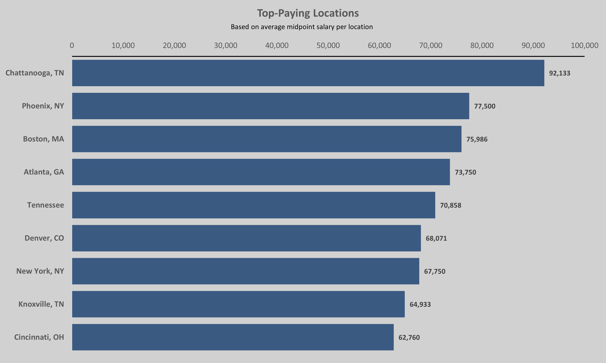

💻 **[View SQL Query](sql/business_queries/Query3.sql)**

---

### Query 4: Which Skills Pay the Most?

**Business Question:** Which technical skills command the highest salaries?

**Key Findings:**
- **Python:** $80,725 average (highest paying skill)
- **SQL:** $75,773 average
- **R:** $72,094 average
- **Tableau:** $71,599 average
- **Power BI:** $70,941 average
- **Excel:** $69,021 average
- **Microsoft Office:** $68,711 average

**Insight:** Programming and statistical skills command the highest salaries. Python leads all skills 
with an $80,725 average — an $11,704 premium over Excel-only roles. SQL remains the second 
highest-paying skill despite being the most common requirement, reinforcing that SQL mastery is 
both essential AND financially rewarding. Visualization tools (Tableau, Power BI) fall in the 
$70-72k range, while general productivity tools (Excel, Microsoft Office) sit slightly lower 
despite being widely required.

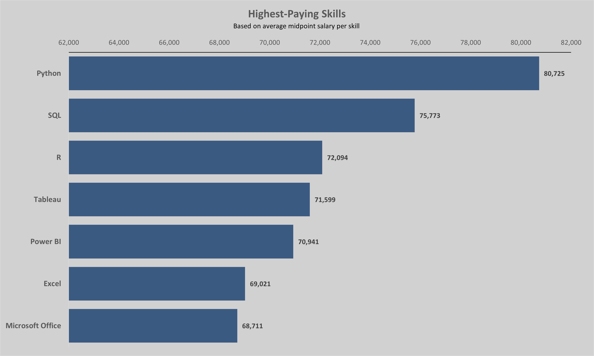

💻 **[View SQL Query](sql/business_queries/Query4.sql)**

---

### Query 5: Most Common Skill Combinations

**Business Question:** Which skill pairs appear together most frequently in job postings?

**Key Findings:**
- **SQL + Excel:** 68% of jobs (most common pairing)
- **SQL + Python:** 42% of jobs
- **SQL + Tableau:** 39% of jobs
- **SQL + Power BI:** 36% of jobs

**Insight:** SQL sits at the center of nearly every skill combination. Employers expect analysts to combine querying (SQL) with manipulation (Excel) and visualization (Tableau/Power BI). Multi-tool proficiency is the norm, not the exception.

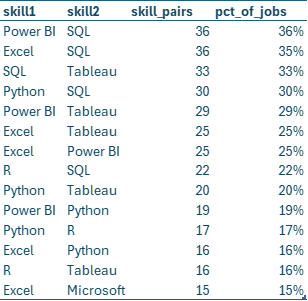

💻 **[View SQL Query](sql/business_queries/Query5.sql)**

---

### Query 6: Python vs Non-Python Salary Comparison

**Business Question:** Is there a measurable salary premium for Python skills?

**Key Findings:**
- **Python Required:** $80,726 average (21 jobs)
- **No Python Required:** $69,004 average (45 jobs)
- **Salary Premium:** $11,722 (17% higher)

**Insight:** Python skills significantly increase earning potential. Roles requiring Python tend to involve automation, scripting, or advanced analytics - higher-value work that commands premium compensation.

**This was a pivotal finding that shifted my learning priorities.**

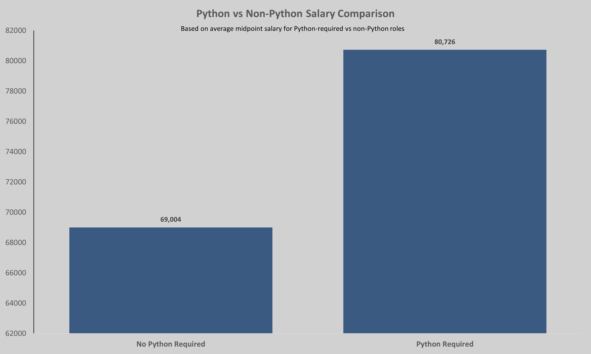

💻 **[View SQL Query](sql/business_queries/Query6.sql)**

---

### Query 7: Skills Most Common in Remote Jobs

**Business Question:** What skills do remote employers prioritize?

**Key Findings:**
- **SQL:** 88% of remote jobs
- **Excel:** 75% of remote jobs
- **Python:** 52% of remote jobs
- **Tableau:** 48% of remote jobs

**Insight:** Remote roles emphasize self-sufficient analysts who can independently query data, analyze it, and present insights. Python appears in over half of remote jobs, reinforcing its value for location-independent work.

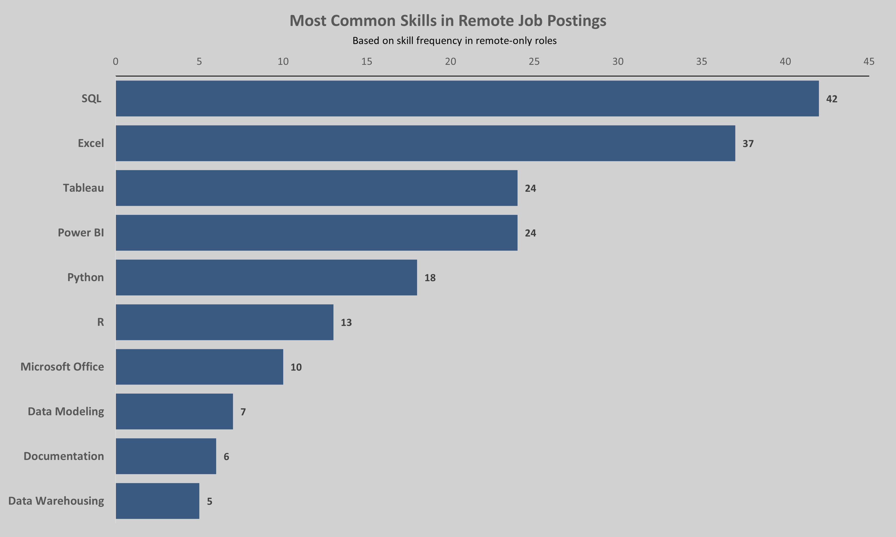

💻 **[View SQL Query](sql/business_queries/Query7.sql)**

---

### Query 8: Entry-Level vs Early-Career Skill Requirements

**Business Question:** How do skill requirements evolve as analysts gain experience?

**Key Findings:**

| Skill | Entry-Level | Early Career | Difference |
|-------|-------------|--------------|------------|
| Python | 15 | 27 | +12 |
| Tableau | 11 | 25 | +14 |
| Power BI | 12 | 24 | +12 |
| SQL | 26 | 34 | +8 |
| Excel | 28 | 30 | +2 |

**Insight:** Entry-level roles emphasize foundational skills (Excel, SQL). As analysts progress to early-career roles (2+ years), employers expect deeper proficiency in visualization tools (Tableau, Power BI) and programming (Python). This defines a clear learning roadmap: master the basics first, then layer in advanced tools.

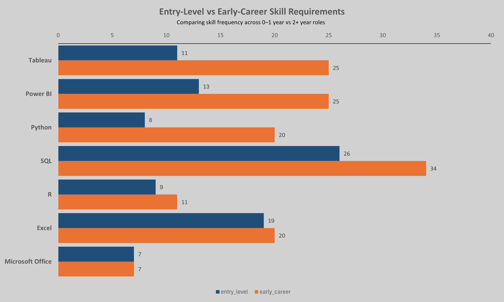

💻 **[View SQL Query](sql/business_queries/Query8.sql)**

---

### Query 9: Which Industries Are Hiring and How They Pay

**Business Question:** Which sectors have the most job openings, and how competitive is their compensation?

**Key Findings:**

**Hiring Volume:**
- **Healthcare Systems:** 14 jobs
- **Finance:** 6 jobs
- **Technology:** 5 jobs

**Salary Levels:**
- **FinTech:** $130k average (small sample - 1-2 jobs)
- **Finance:** $72k average
- **Healthcare:** $70k average
- **Technology:** $69k average

**Insight:** Healthcare offers the best balance of hiring volume and competitive pay. FinTech pays significantly more but has limited openings. This analysis informed my decision to target healthcare organizations in my job search.

***Note: The NULL category represents job postings where industry was not specified in the listing (31 of 100 jobs). Healthcare Systems is the largest identified industry with 14 postings.***

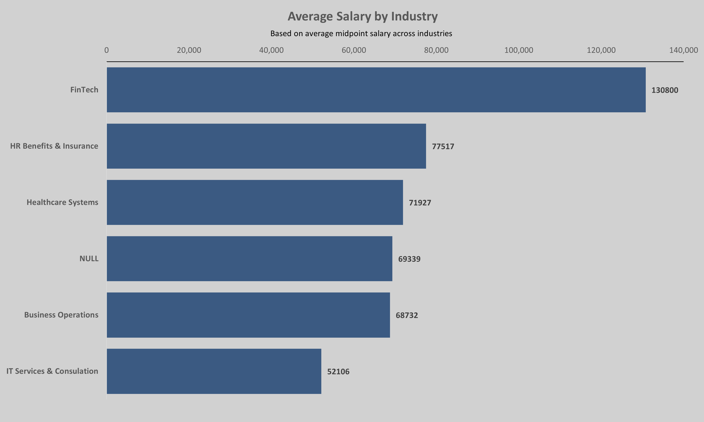
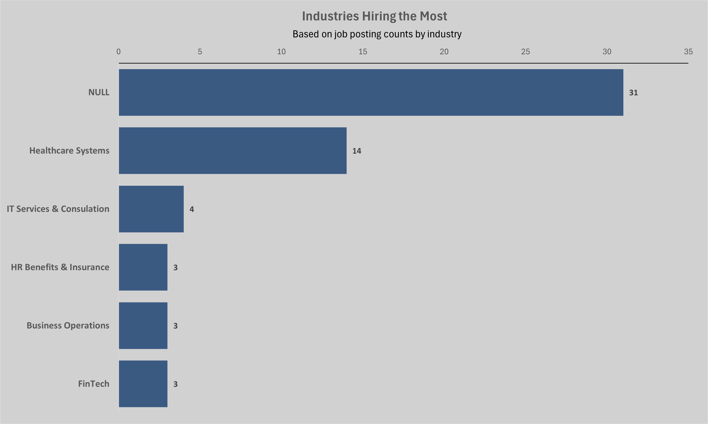

💻 **[View SQL Query](sql/business_queries/Query9.sql)**

---

### Query 10: SQL + Tool Combination Salary Comparison

**Business Question:** How does pairing SQL with different tools affect earning potential?

**Key Findings:**

| Tool Combination | Avg Salary | Job Count |
|-----------------|------------|-----------|
| SQL + Power BI | $76,118 | 4 |
| Other SQL Combinations | $73,210 | 30 |
| SQL + Tableau | $72,890 | 23 |
| SQL + Excel Only | $69,267 | 8 |

**Insight:** Adding a BI tool (Tableau or Power BI) to SQL skills increases salary by $3,500-$7,000 compared to SQL + Excel alone. The "Other SQL Combinations" group (likely including Python or R) also commands premium pay. Pure SQL + Excel roles tend to be more operational and lower-paying.

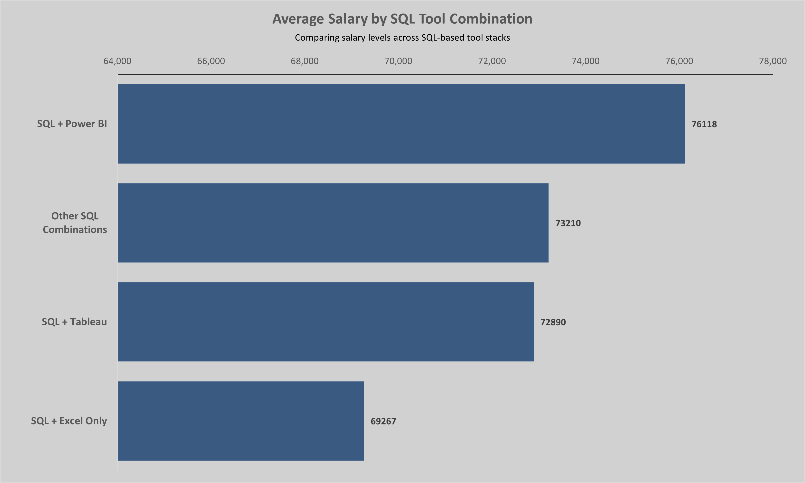

💻 **[View SQL Query](sql/business_queries/Query10.sql)**

---

### Query 11: Industry × Skill Matrix (Advanced Analysis)

**Business Question:** Do different industries prioritize different skills?

**Key Findings:**

| Industry | SQL | Excel | Python | Tableau | Power BI |
|----------|-----|-------|--------|---------|----------|
| Healthcare | 93% | 100% | 36% | 50% | 29% |
| Finance | 100% | 83% | 50% | 50% | 33% |
| Technology | 80% | 60% | 55% | 40% | 20% |

**Insight:** Every industry requires SQL, but tool priorities vary. Healthcare values Excel universally (100%) and Tableau over Power BI. Finance also emphasizes Excel but shows balanced BI tool usage. Technology roles prioritize Python more heavily (55%) compared to other sectors (36-50%). This helps tailor skill development and applications based on target industry.

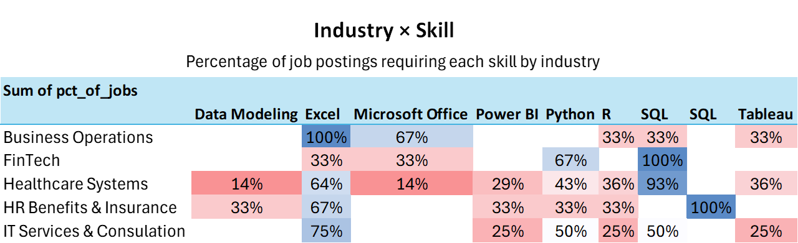

💻 **[View SQL Query](sql/business_queries/Query11.sql)**

---

## 💡 Key Takeaways & How This Changed My Approach

### What I Learned (Technical)
1. **SQL proficiency matters more than I realized** - 87% of jobs require it, and I'm now confident I can deliver at that level
2. **Excel is not a "basic" skill** - It appears in 76% of jobs across all industries and experience levels
3. **Data pipelines require flexibility** - Real-world data is messy; building staging → cleaning workflows is essential
4. **CTEs and joins are everyday tools** - These aren't just academic concepts; they're how you solve real business problems

### What I Learned (Strategic)
1. **Python adds measurable value** - $11k salary premium justifies prioritizing it in my learning roadmap
2. **Remote work is viable** - Competitive pay without geographic constraints opens up more opportunities
3. **Healthcare is a strong target** - High hiring volume + competitive salaries + long-term growth potential
4. **Tool combinations matter** - Learning Tableau or Power BI alongside SQL increases marketability and earning potential

### How This Analysis Informed My Job Search
✅ **Stopped spreading myself thin** - Focused on finishing SQL + Tableau mastery instead of trying to learn everything at once  
✅ **Targeted remote healthcare roles** - Narrowed applications to positions aligning with market insights  
✅ **Prioritized Python learning** - Clear ROI justifies the time investment  
✅ **Confident in my SQL skills** - This project proved to myself I can write production-quality queries  
✅ **Updated resume strategically** - Emphasized SQL, Excel, and analytical thinking over buzzword accumulation  

---

## 📂 Repository Structure

```
📁 data-analyst-job-market-analysis/
├── 📄 README.md                                    # You're reading this
├── 📁 data/
│   ├── job_postings.csv                            # Cleaned postings table (100 jobs)
│   ├── job_skills.csv                              # Cleaned skills table (492 entries)
│   └── data_analyst_project_visuals.xlsx           # All queries + charts in Excel
├── 📁 sql/
│   ├── query1_top_skills.sql                       # Top 10 most in-demand skills
│   ├── query2_experience_salary.sql                # Experience level vs salary
│   ├── query3_top_paying_locations.sql             # Geographic salary analysis
│   ├── query4_top_paying_skills.sql                # Skills commanding highest pay
│   ├── query5_skill_combinations.sql               # Most common skill pairings
│   ├── query6_python_vs_non_python.sql             # Python salary premium analysis
│   ├── query7_remote_job_skills.sql                # Skills in remote positions
│   ├── query8_entry_vs_early_career.sql            # Skill evolution with experience
│   ├── query9_industries_hiring.sql                # Industry hiring patterns + pay
│   ├── query10_sql_tool_combinations.sql           # Tool stack salary comparison
│   └── query11_industry_skill_matrix.sql           # Industry-specific skill priorities
└── 📁 visuals/
    ├── query1_top_skills.png
    ├── query2_experience_salary.png
    ├── query3_top_paying_locations.png
    ├── query4_top_paying_skills.png
    ├── query5_skill_combinations.png
    ├── query6_python_vs_non_python.png
    ├── query7_remote_job_skills.png
    ├── query8_entry_vs_early_career.png
    ├── query9_industries_hiring.png
    ├── query10_sql_tool_combinations.png
    └── query11_industry_skill_matrix.png
```

---

## 🚀 Next Steps

### Immediate Actions
- ✅ Apply findings to resume and cover letters
- ✅ Target remote healthcare analyst roles
- ✅ Continue SQL practice with real-world datasets

### Short-Term Learning Goals
- Complete Tableau/Power BI fundamentals course
- Build 2-3 more SQL analysis projects
- Strengthen Python pandas skills for data manipulation

### Long-Term Career Vision
- Secure entry-level data analyst role (leveraging SQL + Excel + visualization)
- Build Python proficiency on the job (targeting +$11k salary increase)
- Progress toward data engineering roles within 2-3 years

---

## 🔧 How to Use This Project

### For Recruiters/Hiring Managers:
This project demonstrates:
- ✅ **SQL proficiency:** Joins, CTEs, aggregations, conditional logic, data cleaning
- ✅ **Business thinking:** Translating data into actionable insights
- ✅ **Self-directed learning:** Identified a problem, designed a solution, executed independently
- ✅ **Communication:** Clear documentation and visualization of complex findings

### For Fellow Job Seekers:
Feel free to replicate this analysis:
1. Collect 100+ job postings manually (Indeed, LinkedIn)
2. Structure data in CSV format (postings + skills tables)
3. Load into SQL Server or PostgreSQL
4. Run similar queries to understand your target market
5. Visualize findings in Excel or Tableau

---

## 📬 Connect With Me

**Stephanie Mitchell**  
📧 stephmitch023@gmail.com  
💼 [LinkedIn](https://www.linkedin.com/in/stephanie--mitchell/)  
📍 Knoxville, TN | Open to Remote Opportunities

---

## 📝 Reflection

This project transformed my job search from a frustrating guessing game into a data-informed strategy. More importantly, it proved to myself that I have the SQL skills, analytical thinking, and problem-solving ability to succeed as a data analyst.

The biggest takeaway? **I know more than I thought I did.** And now I have the evidence to prove it.

---

*Project completed: April 2026*  
*Tools: SQL Server, Excel, GitHub*  
*Dataset: 100 real job postings collected manually from Indeed and LinkedIn*

---

**⭐ If you found this analysis helpful, feel free to star this repository or reach out with questions!**
